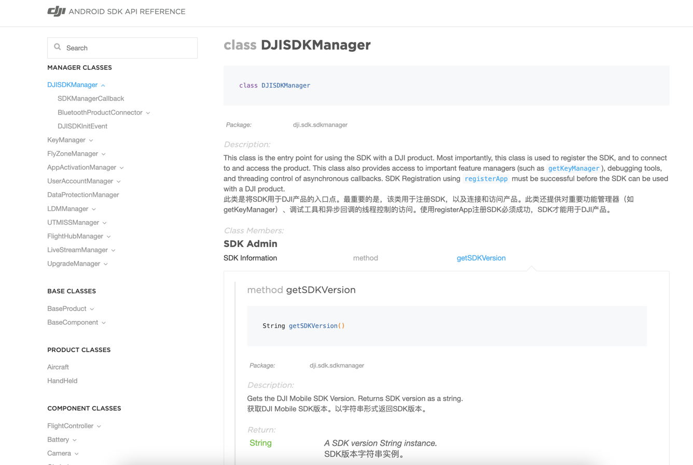

# 大疆安卓SDK API翻译工具
## 工具说明
此工具用来将大疆Android SDK V4 的 `API Reference` 文档翻译成中文。

注意当前只翻译了 `Description` 中的内容。

项目中 `API Reference`目录中的内容为翻译后的。原始文档内容请访问 https://github.com/dji-sdk/Mobile-SDK-Android


翻译后的效果：



## 代码说明
1、翻译API采用了百度翻译，可访问 https://fanyi-api.baidu.com/api/trans/ 注册申请百度通用翻译`APP_ID`和`SECURITY_KEY`

2、将`APP_ID`和`SECURITY_KEY` 设置在 `TransSDK`类中，并更改要翻译的目录
```java
//更改要翻译的文件夹
String dir = "./API Reference/Utils";
```
3、运行`Main`函数即可
